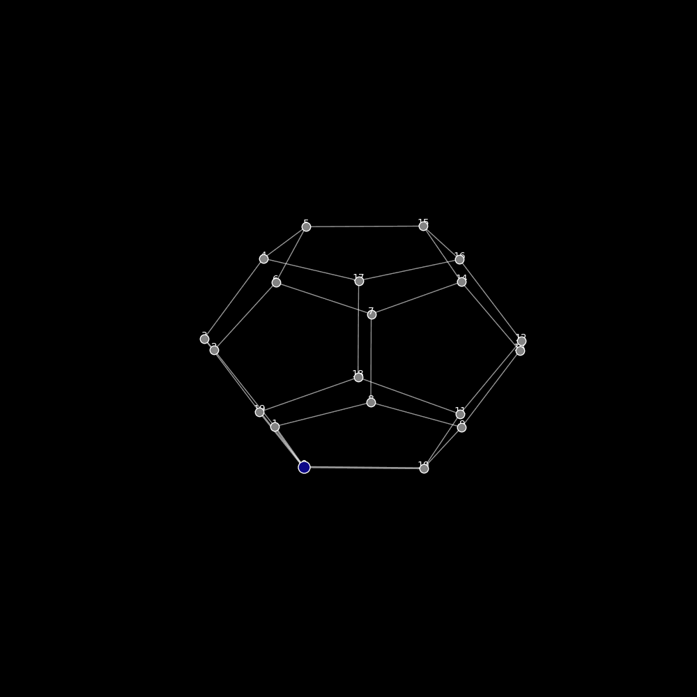

# Grafos

Este repositorio está dedicado a explorar la Teoría de Grafos y sus aplicaciones en Big Data. Contiene una combinación de recursos teóricos, implementaciones prácticas y proyectos de aplicación que demuestran cómo los grafos pueden ser utilizados para resolver problemas complejos en análisis de redes, optimización de algoritmos y modelado de estructuras de datos. Los grafos ofrecen una poderosa herramienta matemática para representar y analizar grandes volúmenes de datos interconectados, común en ámbitos como redes sociales, recomendaciones de productos, y optimización de rutas.

## Contenido

- [Clases de Big Data](#clases-de-big-data)
- [Teoría de Grafos](#teoría-de-grafos)
- [Aplicaciones](#aplicaciones)
- [Material Adicional](#material-adicional)

## Clases de Big Data

- `BIG_DATA_Clase_Cuarta.ipynb`: Introducción al uso de la teoría de grafos en redes sociales, con ejemplos prácticos sobre detección de comunidades.
- `BIG_DATA_Digrafos_y_Redes_Clase.ipynb`: Digrafos y análisis de redes orientadas en el contexto de Big Data.

## Teoría de Grafos

- `Graph_Convolution_Network.ipynb`: Implementación y estudio de las redes neuronales convolucionales sobre grafos.
- `Hipergrafo_y_ciclo_hamiltoniano.ipynb`: Ejemplo de un ciclo hamiltoniano y su implementación en un hipergrafo.

## Aplicaciones

- `Revolucion_de_la_Credibilidad.ipynb`: Análisis basado en grafos aplicado a estudios de credibilidad en redes sociales.
- `Wheel_graphs.ipynb`: Estudio sobre los grafos tipo rueda y sus propiedades.

## Objetivos de aprendizaje

- **Clases de Big Data**: 
  1. Entender el uso de grafos en el análisis de redes sociales.
  2. Aplicar algoritmos de detección de comunidades y centralidad en redes.
  3. Usar estructuras de grafos para resolver problemas de optimización en grandes datasets.
     
## Ejemplos Visuales

### Animación de Dodecaedro y BFS
Esta animación muestra el proceso de recorrido en un dodecaedro utilizando el algoritmo BFS (Búsqueda en Anchura).

## Recursos adicionales

- [Introduction to Graph Theory - Robin J. Wilson](https://link)
- [Graph Neural Networks: A Review](https://arxiv.org/abs/1901.00596)
- [NetworkX Documentation](https://networkx.org/)

- Uso del Repositorio
Para clonar el repositorio y acceder a los notebooks:

bash
Copiar código
git clone https://github.com/sgevatschnaider/Grafos.git
cd Grafos
jupyter notebook
Abre el notebook de tu interés en Jupyter Notebook y ejecuta los ejemplos interactivos.

Colaboración
¡Las contribuciones son bienvenidas! Si tienes ideas para mejorar los algoritmos, agregar nuevos ejemplos o proponer proyectos, no dudes en contribuir. Aquí tienes algunos pasos para colaborar:

Haz un fork de este repositorio.
Crea una nueva rama (git checkout -b feature/nueva-caracteristica).
Realiza tus cambios y haz commit de ellos (git commit -m 'Añadir nueva característica').
Haz push a la rama (git push origin feature/nueva-caracteristica).
Abre un Pull Request para revisar tus cambios.
Licencia
Este proyecto está bajo la licencia MIT. Consulta el archivo LICENSE para más detalles.

